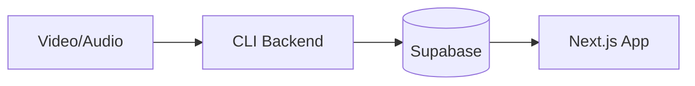

# Sermon Summary

An end-to-end pipeline for transcribing and summarizing sermon videos, with a web application for browsing and searching summaries.

## Overview

This project automates the process of converting sermon recordings into structured, searchable summaries. It consists of two main components:

1. **CLI Backend** — Extracts audio, transcribes using OpenAI Whisper, and generates structured summaries using Claude
2. **Web Application** — A Next.js app for viewing and searching sermon summaries



## Features

### CLI Backend

- **Audio Extraction** — Converts video files to optimized audio using FFmpeg
- **Smart Chunking** — Automatically splits large files to meet API limits
- **Transcription** — Accurate Indonesian transcription via OpenAI Whisper
- **AI Summarization** — Structured summaries using Claude with guaranteed JSON output
- **Database Storage** — Optional persistence to Supabase

### Web Application

- **Search** — Full-text search across sermon titles and summaries
- **Responsive Design** — Works seamlessly on desktop and mobile
- **Beautiful UI** — Editorial-inspired design with elegant typography

## Tech Stack

| Component        | Technology              |
| ---------------- | ----------------------- |
| CLI Runtime      | Node.js, TypeScript     |
| Audio Processing | FFmpeg                  |
| Transcription    | OpenAI Whisper API      |
| Summarization    | Claude (Anthropic)      |
| Database         | Supabase (PostgreSQL)   |
| Web Framework    | Next.js 16 (App Router) |
| Styling          | Tailwind CSS            |
| Deployment       | Netlify                 |

## Project Structure

```
sermon-summary/
├── backend/                 # CLI application
│   ├── src/
│   │   ├── config/          # Configuration management
│   │   ├── services/        # Core services (Audio, Transcription, Summarization, Supabase)
│   │   ├── pipeline/        # Processing pipeline orchestration
│   │   ├── cli/             # Command-line interface
│   │   └── index.ts         # Entry point
│   └── package.json
│
├── app/                     # Next.js web application
│   ├── src/
│   │   ├── app/             # App Router pages
│   │   ├── components/      # React components
│   │   └── lib/             # Utilities and Supabase client
│   └── package.json
│
└── netlify.toml             # Deployment configuration
```

## Getting Started

### Prerequisites

- Node.js 20+
- FFmpeg installed and available in PATH
- OpenAI API key
- Anthropic API key
- Supabase project (for storage and web app)

### Database Setup

Create the `sermons` table in your Supabase project:

```sql
CREATE TABLE sermons (
  id UUID DEFAULT gen_random_uuid() PRIMARY KEY,
  title TEXT NOT NULL,
  summary TEXT NOT NULL,
  key_points TEXT[] NOT NULL,
  bible_verses TEXT[] NOT NULL,
  quotes TEXT[] NOT NULL,
  action_items TEXT[] NOT NULL,
  reflection_questions TEXT[] NOT NULL,
  created_at TIMESTAMPTZ DEFAULT NOW()
);

-- Enable full-text search
ALTER TABLE sermons ADD COLUMN fts tsvector
  GENERATED ALWAYS AS (to_tsvector('english', title || ' ' || summary)) STORED;
CREATE INDEX sermons_fts_idx ON sermons USING GIN (fts);

-- Enable Row Level Security
ALTER TABLE sermons ENABLE ROW LEVEL SECURITY;

-- Allow public read access
CREATE POLICY "Public read access" ON sermons
  FOR SELECT USING (true);
```

### Backend Setup

```bash
cd backend
npm install
cp .env.example .env
```

Configure `.env`:

```env
OPENAI_API_KEY=sk-...
ANTHROPIC_API_KEY=sk-ant-...
SUPABASE_URL=https://xxx.supabase.co
SUPABASE_SERVICE_ROLE_KEY=eyJ...
```

### Web App Setup

```bash
cd app
npm install
cp .env.local.example .env.local
```

Configure `.env.local`:

```env
NEXT_PUBLIC_SUPABASE_URL=https://xxx.supabase.co
NEXT_PUBLIC_SUPABASE_ANON_KEY=eyJ...
```

## Usage

### Processing a Sermon

```bash
cd backend
npx tsx src/index.ts -i /path/to/sermon.mp4 -t "Sermon Title" --save
```

**Options:**

| Flag                  | Description                                |
| --------------------- | ------------------------------------------ |
| `-i, --input <file>`  | Input video or audio file (required)       |
| `-t, --title <title>` | Sermon title (required)                    |
| `--keep-audio`        | Keep extracted audio file after processing |
| `--save`              | Save summary to Supabase                   |

### Running the Web App

```bash
cd app
npm run dev
```

Open [http://localhost:3000](http://localhost:3000) to view the application.

## Summary Output Structure

The AI generates structured summaries with the following sections:

| Section                  | Description                       |
| ------------------------ | --------------------------------- |
| **Summary**              | 2-3 paragraph executive summary   |
| **Key Points**           | 5-7 main takeaways                |
| **Bible Verses**         | Scripture references with context |
| **Quotes**               | Notable quotes from the speaker   |
| **Action Items**         | Practical application steps       |
| **Reflection Questions** | Questions for personal reflection |

## Deployment

The web application is configured for Netlify deployment. Push to your repository and connect to Netlify, or deploy manually:

```bash
cd app
npm run build
```

Required environment variables on Netlify:

- `NEXT_PUBLIC_SUPABASE_URL`
- `NEXT_PUBLIC_SUPABASE_ANON_KEY`

## License

MIT
