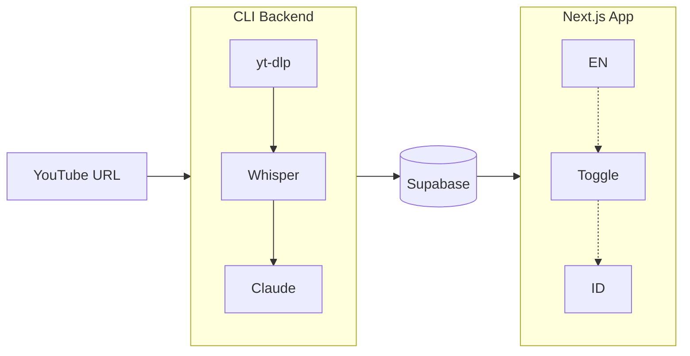

# Sermon Summary

An end-to-end pipeline for transcribing and summarizing sermon videos from YouTube, with a bilingual web application for browsing and searching summaries.

## Overview

This project automates the process of converting YouTube sermon videos into structured, searchable summaries in both English and Indonesian. It consists of two main components:

1. **CLI Backend** — Downloads from YouTube, transcribes using OpenAI Whisper, and generates bilingual summaries using Claude
2. **Web Application** — A Next.js app for viewing and searching sermon summaries with language toggle



## Features

### CLI Backend

- **YouTube Integration** — Downloads audio directly from YouTube URLs via yt-dlp
- **Transcription** — Accurate Indonesian transcription via OpenAI Whisper
- **Bilingual Summaries** — Generates both English and Indonesian summaries in a single run
- **Auto-Generated Titles** — Claude generates appropriate titles from sermon content
- **Database Storage** — Persistence to Supabase with dual-language columns and YouTube link

### Web Application

- **Language Toggle** — Switch between English and Indonesian with localStorage persistence
- **Bilingual Search** — Full-text search using language-specific indexes
- **YouTube Links** — Direct links to original sermon videos
- **Responsive Design** — Works seamlessly on desktop and mobile
- **Beautiful UI** — Editorial-inspired design with elegant typography

## Tech Stack

| Component     | Technology              |
| ------------- | ----------------------- |
| CLI Runtime   | Node.js, TypeScript     |
| YouTube DL    | yt-dlp                  |
| Transcription | OpenAI Whisper API      |
| Summarization | Claude (Anthropic)      |
| Database      | Supabase (PostgreSQL)   |
| Web Framework | Next.js 16 (App Router) |
| Styling       | Tailwind CSS            |
| Deployment    | Netlify                 |

## Project Structure

```
sermon-summary/
├── backend/                 # CLI application
│   ├── src/
│   │   ├── config/          # Configuration management
│   │   ├── services/        # Core services (YouTube, Transcription, Summarization, Supabase)
│   │   ├── pipeline/        # Processing pipeline orchestration
│   │   ├── cli/             # Command-line interface
│   │   └── index.ts         # Entry point
│   └── package.json
│
├── app/                     # Next.js web application
│   ├── src/
│   │   ├── app/             # App Router pages
│   │   ├── components/      # React components
│   │   └── lib/             # Utilities and Supabase client
│   └── package.json
│
└── netlify.toml             # Deployment configuration
```

## Getting Started

### Prerequisites

- Node.js 20+
- yt-dlp installed (`pip install yt-dlp` or `brew install yt-dlp`)
- OpenAI API key
- Anthropic API key
- Supabase project (for storage and web app)

### Database Setup

Create the `sermons` table in your Supabase project:

```sql
CREATE TABLE sermons (
  id UUID DEFAULT gen_random_uuid() PRIMARY KEY,
  title_en TEXT NOT NULL,
  title_id TEXT NOT NULL,
  summary_en TEXT NOT NULL,
  summary_id TEXT NOT NULL,
  key_points_en TEXT[] NOT NULL,
  key_points_id TEXT[] NOT NULL,
  bible_verses_en TEXT[] NOT NULL,
  bible_verses_id TEXT[] NOT NULL,
  quotes_en TEXT[] NOT NULL,
  quotes_id TEXT[] NOT NULL,
  action_items_en TEXT[] NOT NULL,
  action_items_id TEXT[] NOT NULL,
  reflection_questions_en TEXT[] NOT NULL,
  reflection_questions_id TEXT[] NOT NULL,
  youtube_url TEXT,
  created_at TIMESTAMPTZ DEFAULT NOW()
);

-- Full-text search for both languages
ALTER TABLE sermons ADD COLUMN fts_en tsvector
  GENERATED ALWAYS AS (to_tsvector('english', title_en || ' ' || summary_en)) STORED;
ALTER TABLE sermons ADD COLUMN fts_id tsvector
  GENERATED ALWAYS AS (to_tsvector('indonesian', title_id || ' ' || summary_id)) STORED;

CREATE INDEX sermons_fts_en_idx ON sermons USING GIN (fts_en);
CREATE INDEX sermons_fts_id_idx ON sermons USING GIN (fts_id);

-- Enable Row Level Security
ALTER TABLE sermons ENABLE ROW LEVEL SECURITY;

-- Allow public read access
CREATE POLICY "Public read access" ON sermons
  FOR SELECT USING (true);
```

### Backend Setup

```bash
cd backend
npm install
cp .env.example .env
```

Configure `.env`:

```env
OPENAI_API_KEY=sk-...
ANTHROPIC_API_KEY=sk-ant-...
SUPABASE_URL=https://xxx.supabase.co
SUPABASE_SERVICE_ROLE_KEY=eyJ...
```

### Web App Setup

```bash
cd app
npm install
cp .env.local.example .env.local
```

Configure `.env.local`:

```env
NEXT_PUBLIC_SUPABASE_URL=https://xxx.supabase.co
NEXT_PUBLIC_SUPABASE_ANON_KEY=eyJ...
```

## Usage

### Processing a Sermon

```bash
cd backend
npx tsx src/index.ts -i "https://youtube.com/watch?v=xxx" --save
```

**Options:**

| Flag               | Description                          |
| ------------------ | ------------------------------------ |
| `-i, --input <url>` | YouTube URL (required)              |
| `--save`           | Save summary to Supabase             |

> **Note:** Sermon titles are automatically generated by Claude based on the content. The YouTube URL is saved to the database for linking in the web app.

### Running the Web App

```bash
cd app
npm run dev
```

Open [http://localhost:3000](http://localhost:3000) to view the application.

## Summary Output Structure

The AI generates bilingual structured summaries (English + Indonesian) with the following sections:

| Section                  | Description                                  |
| ------------------------ | -------------------------------------------- |
| **Title**                | Auto-generated title from sermon content     |
| **Summary**              | 2-3 paragraph executive summary              |
| **Key Points**           | 5-7 main takeaways                           |
| **Bible Verses**         | Scripture references with context            |
| **Quotes**               | Notable quotes from the speaker (verbatim)   |
| **Action Items**         | Practical application steps                  |
| **Reflection Questions** | Questions for personal reflection/discussion |

Each section is generated in both English and Indonesian, stored in separate database columns (e.g., `title_en`, `title_id`).

## Deployment

The web application is configured for Netlify deployment. Push to your repository and connect to Netlify, or deploy manually:

```bash
cd app
npm run build
```

Required environment variables on Netlify:

- `NEXT_PUBLIC_SUPABASE_URL`
- `NEXT_PUBLIC_SUPABASE_ANON_KEY`

## License

MIT
