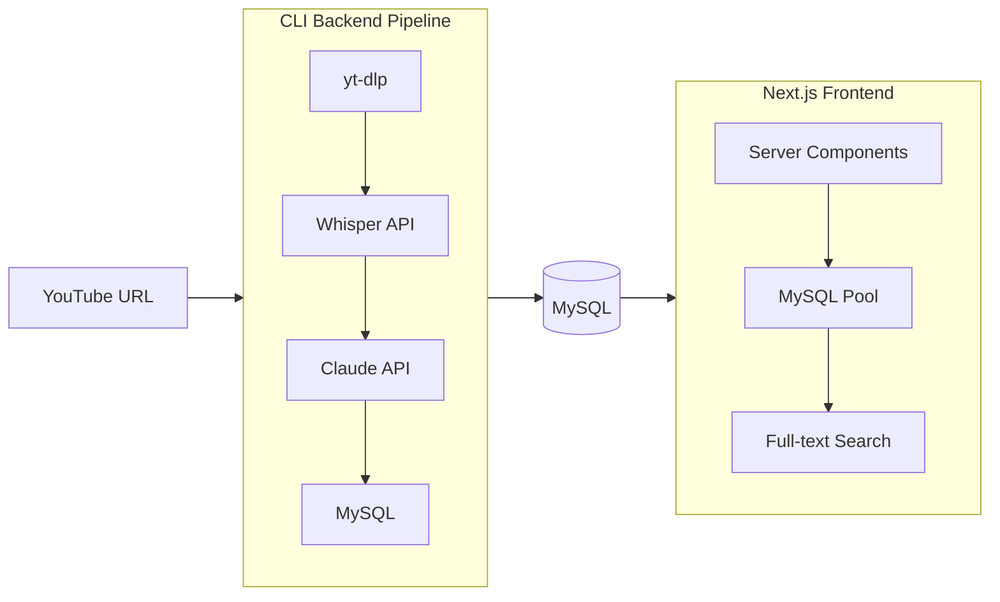

# Catatan Firman

An end-to-end pipeline for transcribing and summarizing Indonesian sermon videos from YouTube, with a bilingual web application for browsing and searching summaries.

## Screenshots

> Add screenshots here

## Overview

This project automates the process of converting YouTube sermon videos into structured, searchable summaries in both English and Indonesian. It consists of two main components:

1. **CLI Backend** — Downloads YouTube audio, transcribes using OpenAI Whisper, and generates bilingual summaries using Anthropic Claude
2. **Next.js Frontend** — Server-rendered web app for viewing and searching sermon summaries with direct MySQL access

## Architecture



The backend processes videos offline via CLI, while the frontend reads directly from MySQL using Next.js server components for optimal performance and security.

## Features

### CLI Backend

- **YouTube Integration** — Downloads audio directly from YouTube URLs using yt-dlp (security: uses `execFile` to prevent shell injection)
- **Transcription** — Accurate Indonesian transcription via OpenAI Whisper API
- **Bilingual Summaries** — Generates both English and Indonesian summaries in a single run using Claude's structured outputs
- **Auto-Generated Titles** — Claude generates appropriate titles from sermon content
- **Structured Data** — Extracts key points, Bible verses, quotes, action items, and reflection questions
- **Database Storage** — Persistence to MySQL with bilingual columns and YouTube link

### Next.js Frontend

- **Server-Side Rendering** — Fast initial page loads with React Server Components
- **Direct MySQL Access** — No API layer, uses connection pooling for efficiency
- **Full-Text Search** — MySQL FULLTEXT indexes for fast bilingual search
- **Input Validation** — Sanitizes search terms and validates ID parameters
- **Security Headers** — Comprehensive CSP, X-Frame-Options, and other security headers
- **Responsive Design** — Works seamlessly on desktop and mobile
- **Beautiful Typography** — Editorial-inspired design with Fraunces and Newsreader fonts

## Tech Stack

| Component | Technology |
|-----------|------------|
| **Frontend Framework** | Next.js 16 (App Router) |
| **Frontend UI** | React 19, Tailwind CSS 4 |
| **Backend Runtime** | Node.js, TypeScript |
| **Database** | MySQL 8.0+ |
| **YouTube Download** | yt-dlp |
| **Transcription** | OpenAI Whisper API |
| **Summarization** | Anthropic Claude (claude-sonnet-4-5) |
| **Schema Validation** | Zod |
| **CLI Framework** | Commander.js |

## Prerequisites

- Node.js 20+
- MySQL 8.0+
- yt-dlp installed (`pip install yt-dlp` or `brew install yt-dlp`)
- OpenAI API key
- Anthropic API key

## Database Setup

Create the `catatan-firman` database and `sermons` table in MySQL:

```sql
CREATE DATABASE IF NOT EXISTS `catatan-firman` CHARACTER SET utf8mb4 COLLATE utf8mb4_unicode_ci;

USE `catatan-firman`;

CREATE TABLE `sermons` (
  `id` INT UNSIGNED AUTO_INCREMENT PRIMARY KEY,
  `title_en` TEXT NOT NULL,
  `title_id` TEXT NOT NULL,
  `summary_en` TEXT NOT NULL,
  `summary_id` TEXT NOT NULL,
  `key_points_en` JSON NOT NULL,
  `key_points_id` JSON NOT NULL,
  `bible_verses_en` JSON NOT NULL,
  `bible_verses_id` JSON NOT NULL,
  `quotes_en` JSON NOT NULL,
  `quotes_id` JSON NOT NULL,
  `action_items_en` JSON NOT NULL,
  `action_items_id` JSON NOT NULL,
  `reflection_questions_en` JSON NOT NULL,
  `reflection_questions_id` JSON NOT NULL,
  `youtube_url` TEXT,
  `created_at` TIMESTAMP DEFAULT CURRENT_TIMESTAMP,
  FULLTEXT INDEX `ft_title_summary_id` (`title_id`, `summary_id`)
) ENGINE=InnoDB DEFAULT CHARSET=utf8mb4 COLLATE=utf8mb4_unicode_ci;
```

The FULLTEXT index enables fast search across Indonesian titles and summaries.

## Setup

### Backend Setup

```bash
cd backend
npm install
cp .env.example .env
```

Configure `backend/.env`:

| Variable | Required | Description |
|----------|----------|-------------|
| `OPENAI_API_KEY` | Yes | OpenAI API key for Whisper transcription |
| `ANTHROPIC_API_KEY` | Yes | Anthropic API key for Claude summarization |
| `MYSQL_HOST` | For `--save` | MySQL server hostname (default: localhost) |
| `MYSQL_USER` | For `--save` | MySQL username (default: root) |
| `MYSQL_PASSWORD` | For `--save` | MySQL password |
| `MYSQL_DATABASE` | For `--save` | Database name (catatan-firman) |
| `MYSQL_PORT` | For `--save` | MySQL port (default: 3306) |

Example:

```env
OPENAI_API_KEY=sk-...
ANTHROPIC_API_KEY=sk-ant-...

# Required only when using --save flag
MYSQL_HOST=localhost
MYSQL_USER=root
MYSQL_PASSWORD=your_password
MYSQL_DATABASE=catatan-firman
MYSQL_PORT=3306
```

### Frontend Setup

```bash
cd app
npm install
cp .env.local.example .env.local
```

Configure `app/.env.local`:

| Variable | Required | Description |
|----------|----------|-------------|
| `MYSQL_HOST` | Yes | MySQL server hostname |
| `MYSQL_USER` | Yes | MySQL username |
| `MYSQL_PASSWORD` | Yes | MySQL password |
| `MYSQL_DATABASE` | Yes | Database name (catatan-firman) |

Example:

```env
MYSQL_HOST=localhost
MYSQL_USER=root
MYSQL_PASSWORD=your_password
MYSQL_DATABASE=catatan-firman
```

## Usage

### Processing a Sermon (CLI)

```bash
cd backend
npm start -- -i "https://youtube.com/watch?v=xxx" --save
```

**Command-line Options:**

| Flag | Description |
|------|-------------|
| `-i, --input <url>` | YouTube URL (required) |
| `--save` | Save summary to MySQL database |

**Example Output:**

```
╔══════════════════════════════════════════════════════════════╗
║  Catatan Firman — Sermon Transcription & Summarization      ║
╚══════════════════════════════════════════════════════════════╝

Input: https://youtube.com/watch?v=xxx

Step 1: Downloading from YouTube...
Duration: 45 minutes
Step 2: Transcribing...
Transcription: 12543 chars
Step 3: Summarizing...
Done!

TITLE (EN): Walking in Faith During Uncertain Times
TITLE (ID): Berjalan dalam Iman di Tengah Ketidakpastian

...

Saving to MySQL...
Saved with ID: 1 (Walking in Faith During Uncertain Times)
```

### Running the Frontend

```bash
cd app
npm run dev
```

Open [http://localhost:3000](http://localhost:3000)

**Production Build:**

```bash
cd app
npm run build
npm start
```

## Project Structure

```
catatan-firman/
├── backend/                          # CLI application
│   ├── src/
│   │   ├── cli/                      # CLI parsing and output
│   │   │   ├── args.ts               # Commander.js argument parsing
│   │   │   ├── output.ts             # Console formatting
│   │   │   └── index.ts
│   │   ├── config/
│   │   │   └── index.ts              # Environment variable validation
│   │   ├── errors/
│   │   │   └── index.ts              # Custom error types
│   │   ├── pipeline/
│   │   │   ├── Pipeline.ts           # Main orchestration
│   │   │   └── index.ts
│   │   ├── services/
│   │   │   ├── prompts/
│   │   │   │   └── summarization.ts  # Claude prompt templates
│   │   │   ├── schemas/
│   │   │   │   └── summary.ts        # Zod validation schemas
│   │   │   ├── AudioService.ts       # Audio file cleanup
│   │   │   ├── MysqlService.ts       # Database persistence
│   │   │   ├── SummarizationService.ts  # Claude API client
│   │   │   ├── TranscriptionService.ts  # Whisper API client
│   │   │   ├── YouTubeService.ts     # yt-dlp wrapper
│   │   │   └── index.ts
│   │   ├── types/
│   │   │   └── index.ts              # TypeScript type definitions
│   │   └── index.ts                  # Entry point
│   ├── package.json
│   └── .env.example
│
├── app/                              # Next.js web application
│   ├── src/
│   │   ├── app/
│   │   │   ├── [id]/
│   │   │   │   └── page.tsx          # Sermon detail page
│   │   │   ├── layout.tsx            # Root layout with fonts
│   │   │   ├── page.tsx              # Homepage with search
│   │   │   └── globals.css
│   │   ├── components/
│   │   │   ├── HomeContent.tsx       # Client-side search form
│   │   │   └── SermonDetail.tsx      # Sermon display
│   │   └── lib/
│   │       ├── db.ts                 # MySQL client (server-only)
│   │       └── types.ts              # Shared types
│   ├── next.config.ts                # Security headers
│   ├── package.json
│   └── .env.local
│
└── README.md
```

## Summary Output Structure

The AI generates bilingual structured summaries (English + Indonesian) with the following sections:

| Section | Description |
|---------|-------------|
| **Title** | Auto-generated title from sermon content (3-8 words) |
| **Summary** | 2-3 paragraph executive summary capturing main theme and key takeaways |
| **Key Points** | 5-7 main takeaways including core teachings and illustrations |
| **Bible Verses** | Scripture references with brief context (empty if none mentioned) |
| **Quotes** | 2-4 notable quotes from the speaker (verbatim, in original language) |
| **Action Items** | 3-5 specific, actionable steps listeners can apply |
| **Reflection Questions** | 2-3 thought-provoking questions for reflection or discussion |

Each section is generated in both English and Indonesian, stored in separate database columns (e.g., `title_en`, `title_id`).

## Security Features

### Backend

- **Shell Injection Prevention** — Uses `execFile` instead of `exec` for yt-dlp execution
- **Input Validation** — YouTube URL validation before processing
- **Parameterized Queries** — All database queries use prepared statements
- **Error Boundaries** — Custom error types with error wrapping

### Frontend

- **Server-Only Database Access** — MySQL client marked with `server-only` package
- **Content Security Policy** — Strict CSP with minimal inline script allowances
- **Security Headers** — X-Frame-Options, X-Content-Type-Options, Referrer-Policy
- **Input Sanitization** — Search query sanitization removes MySQL special characters
- **ID Validation** — Integer validation and bounds checking for sermon IDs
- **Connection Pooling** — Limited connection pool size prevents resource exhaustion

## Development

### Backend

```bash
cd backend
npm run dev  # Watch mode with tsx
```

### Frontend

```bash
cd app
npm run dev    # Development server with hot reload
npm run lint   # ESLint
```

## License

MIT

---

**Demo:** [https://catatan-firman.netlify.app/](https://catatan-firman.netlify.app/)
