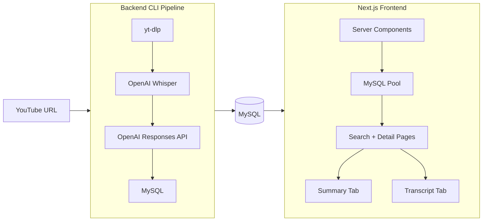

# Catatan Firman

An end-to-end pipeline for transcribing and summarizing Indonesian sermon videos from YouTube, with a web application for browsing, searching, and reading sermon notes.

## Overview

This project converts YouTube sermon videos into structured, searchable Indonesian notes. It consists of:

1. **Backend CLI** — downloads YouTube audio, transcribes it with OpenAI Whisper, summarizes it with OpenAI, and can persist the result to MySQL.
2. **Next.js Frontend** — server-rendered web app for browsing, searching, and reading sermon summaries and timestamped transcripts.
3. **MySQL Database** — stores summaries, structured JSON fields, YouTube URLs, transcript text, and timestamped transcript segments.
4. **Docker Compose Stack** — runs MySQL and the production Next.js app, with an optional backend CLI service for processing videos.

## Architecture


```mermaid
flowchart LR
    A[YouTube URL] --> B[Backend CLI]
    B --> C[(MySQL)]
    C --> D[Next.js App]

    subgraph B[Backend CLI Pipeline]
        B1[yt-dlp] --> B2[OpenAI Whisper]
        B2 --> B3[OpenAI Responses API]
        B3 --> B4[MySQL]
    end

    subgraph D[Next.js Frontend]
        D1[Server Components] --> D2[MySQL Pool]
        D2 --> D3[Search + Detail Pages]
        D3 --> D4[Summary Tab]
        D3 --> D5[Transcript Tab]
    end
```

The backend runs as an offline CLI pipeline. The frontend reads directly from MySQL using Next.js server components and shows each sermon as a summary view plus a transcript view when timestamped segments are available.

## Features

### Backend CLI

- **YouTube integration** — downloads audio from YouTube URLs using `yt-dlp`.
- **OpenAI transcription** — transcribes Indonesian sermon audio with Whisper and a sermon-specific transcription prompt.
- **Timestamped transcript persistence** — stores full transcript text and Whisper segment timestamps in MySQL.
- **OpenAI summarization** — generates structured Indonesian summaries with OpenAI JSON schema output.
- **Structured data** — extracts title, summary, key points, Bible verses, quotes, action items, and reflection questions.
- **Database storage** — saves sermon data and the source YouTube URL when `--save` is used.

### Next.js Frontend

- **Server-side rendering** — fast initial page loads with React Server Components.
- **Direct MySQL access** — uses a server-only MySQL connection pool without a separate API layer.
- **Full-text search** — MySQL FULLTEXT index over sermon titles and summaries.
- **Transcript tab** — sermon detail pages include separate `Ringkasan` and `Transkrip` tabs.
- **Timestamped transcript display** — transcript segments show start times for easier navigation back to the source recording.
- **Input validation** — sanitizes search terms and validates ID parameters.
- **Security headers** — configured in the Next.js app.
- **Responsive design** — works on desktop and mobile.

## Tech Stack

| Component | Technology |
|-----------|------------|
| **Frontend Framework** | Next.js 16 App Router |
| **Frontend UI** | React 19, Tailwind CSS 4 |
| **Backend Runtime** | Node.js 20+, TypeScript |
| **Database** | MySQL 8.0+ / Docker image `mysql:8.4` |
| **YouTube Download** | yt-dlp |
| **Transcription** | OpenAI Whisper API |
| **Summarization** | OpenAI Responses API |
| **Schema Validation** | Zod |
| **CLI Framework** | Commander.js |
| **Containers** | Docker, Docker Compose |

## Prerequisites

For local development without Docker:

- Node.js 20+
- MySQL 8.0+
- `yt-dlp` installed (`brew install yt-dlp` or `pip install yt-dlp`)
- OpenAI API key

For Docker usage:

- Docker and Docker Compose
- OpenAI API key when running the backend CLI service

## Environment Variables

### Backend CLI

Create `backend/.env` for local CLI usage.

| Variable | Required | Description |
|----------|----------|-------------|
| `OPENAI_API_KEY` | Yes | OpenAI API key for transcription and summarization. |
| `OPENAI_SUMMARY_MODEL` | No | OpenAI model for summarization. Defaults to `gpt-4.1-mini`. |
| `MYSQL_HOST` | For `--save` | MySQL server hostname. |
| `MYSQL_DATABASE` | For `--save` | Database name. |
| `MYSQL_USER` | No | MySQL username. Defaults to `root` locally. |
| `MYSQL_PASSWORD` | No | MySQL password. Defaults to empty locally. |
| `MYSQL_PORT` | No | MySQL port. Defaults to `3306`. |
| `INGEST_BASIC_PASSWORD` | For API server | Password for Basic Auth on `POST /api/ingest`. |
| `PORT` | For API server | HTTP API port. Defaults to `3000`. |

Example:

```env
OPENAI_API_KEY=sk-...
OPENAI_SUMMARY_MODEL=gpt-4.1-mini

MYSQL_HOST=localhost
MYSQL_USER=root
MYSQL_PASSWORD=your-password
MYSQL_DATABASE=catatan-firman
MYSQL_PORT=3306
```

### Frontend App

Create `app/.env.local` for local frontend usage.

| Variable | Required | Description |
|----------|----------|-------------|
| `MYSQL_HOST` | Yes | MySQL server hostname. |
| `MYSQL_USER` | Yes | MySQL username. |
| `MYSQL_PASSWORD` | Yes | MySQL password. |
| `MYSQL_DATABASE` | Yes | Database name. |

Example:

```env
MYSQL_HOST=localhost
MYSQL_USER=root
MYSQL_PASSWORD=your-password
MYSQL_DATABASE=catatan-firman
```

### Docker Compose

Docker Compose can be configured from a root `.env` file or shell environment.

| Variable | Default | Description |
|----------|---------|-------------|
| `MYSQL_DATABASE` | `catatan-firman` | Database created by the MySQL container. |
| `MYSQL_USER` | `catatan` | App/CLI database user. |
| `MYSQL_PASSWORD` | `catatan` | App/CLI database password. |
| `MYSQL_ROOT_PASSWORD` | `catatan-root` | MySQL root password. |
| `MYSQL_HOST_PORT` | `3307` | Host port mapped to container port `3306`. |
| `APP_HOST_PORT` | `3001` | Host port mapped to the Next.js container port `3000`. |
| `OPENAI_API_KEY` | empty | Required only when running the backend CLI container. |
| `OPENAI_SUMMARY_MODEL` | `gpt-4.1-mini` | Optional summarization model for the backend CLI container. |

## Database Schema and Migrations

The canonical SQL files are:

- `docker/mysql/init/001_create_sermons.sql` — creates the `sermons` table for a fresh Docker MySQL volume.
- `backend/migrations/001_add_transcript_fields.sql` — adds `transcript` and `transcript_segments` to an existing database.

The current `sermons` table stores:

- summary fields: `title`, `summary`, `key_points`, `bible_verses`, `quotes`, `action_items`, `reflection_questions`
- source metadata: `youtube_url`, `created_at`
- transcript fields: `transcript`, `transcript_segments`
- search index: FULLTEXT index on `title` and `summary`

For an existing local database, run the migration manually after backing up data:

```bash
mysql -u root -p catatan-firman < backend/migrations/001_add_transcript_fields.sql
```

## Setup

### Backend Setup

```bash
cd backend
npm install
cp .env.example .env
```

Then configure `backend/.env` with the variables above.

### Frontend Setup

```bash
cd app
npm install
cp .env.local.example .env.local
```

Then configure `app/.env.local` with the MySQL variables above.

## Usage

### Processing a Sermon Locally

```bash
cd backend
npm start -- -i "https://youtube.com/watch?v=xxx" --save
```

Command-line options:

| Flag | Description |
|------|-------------|
| `-i, --input <url>` | YouTube URL. Required. |
| `--save` | Save the summary, transcript, and transcript segments to MySQL. |

### Triggering Ingestion through the Backend API

Start the guarded ingest API:

```bash
cd backend
INGEST_BASIC_PASSWORD=change-me npm run serve
```

Trigger processing with Basic Auth. Any username is accepted; the password must match `INGEST_BASIC_PASSWORD`.

```bash
curl -X POST "http://localhost:3000/api/ingest" \
  -u "local:change-me" \
  -H "Content-Type: application/json" \
  -d '{"youtubeUrl":"https://youtube.com/watch?v=xxx"}'
```

Health check:

```bash
curl "http://localhost:3000/health"
```

### Running the Frontend Locally

```bash
cd app
npm run dev
```

Open [http://localhost:3000](http://localhost:3000).

Production build:

```bash
cd app
npm run build
npm start
```

## Docker Compose Usage

Start MySQL and the production Next.js app:

```bash
docker compose up --build
```

Services:

| Service | Description |
|---------|-------------|
| `mysql` | MySQL 8.4 with schema initialization from `docker/mysql/init`. Exposed on `localhost:3307` by default. |
| `app` | Production Next.js app. Exposed on [http://localhost:3001](http://localhost:3001) by default. |
| `backend` | Optional CLI service under the `cli` profile. |
| `backend-api` | Optional ingest API service under the `api` profile. Exposed on [http://localhost:3002](http://localhost:3002) by default. |

Run the backend CLI through Docker Compose:

```bash
OPENAI_API_KEY=sk-... docker compose --profile cli run --rm backend -i "https://youtube.com/watch?v=xxx" --save
```

The backend container connects to MySQL through the Compose network and stores processed sermons in the `mysql` service database.

Run the backend API through Docker Compose:

```bash
OPENAI_API_KEY=sk-... INGEST_BASIC_PASSWORD=change-me docker compose --profile api up --build backend-api
```

## Project Structure

```text
catatan-firman/
├── app/                              # Next.js web application
│   ├── src/
│   │   ├── app/                      # App Router pages and layout
│   │   ├── components/               # UI components, including sermon detail tabs
│   │   └── lib/                      # MySQL access and shared frontend types
│   ├── Dockerfile                    # Production Next.js image
│   ├── next.config.ts                # Next.js config and security headers
│   └── package.json
├── backend/                          # CLI application
│   ├── migrations/                   # SQL migrations for existing databases
│   ├── src/
│   │   ├── cli/                      # CLI parsing and console output
│   │   ├── config/                   # Environment variable loading and validation
│   │   ├── pipeline/                 # Pipeline orchestration
│   │   ├── services/                 # YouTube, transcription, summarization, MySQL
│   │   └── types/                    # Backend TypeScript types
│   ├── Dockerfile                    # Backend CLI image with yt-dlp dependencies
│   └── package.json
├── docker/
│   └── mysql/init/                   # Fresh database initialization SQL
├── docker-compose.yml
└── README.md
```

## Summary Output Structure

The AI generates structured summaries with the following sections:

| Section | Description |
|---------|-------------|
| **Title** | Auto-generated Indonesian title from sermon content. |
| **Summary** | 2-3 paragraph summary capturing the main theme and key takeaways. |
| **Key Points** | 5-7 main teachings or arguments from the sermon. |
| **Bible Verses** | Scripture references explicitly mentioned or clearly used in the transcript. |
| **Quotes** | 2-4 notable speaker statements copied as faithfully as the transcript allows. |
| **Action Items** | 3-5 specific, grounded application steps. |
| **Reflection Questions** | 2-3 questions for personal reflection or group discussion. |

## Development and Validation

### Backend

```bash
cd backend
npm run dev        # Watch mode with tsx
npm run typecheck  # TypeScript typecheck
npm run build      # Build validation; currently runs TypeScript with no emit
```

### Frontend

```bash
cd app
npm run dev    # Development server
npm run lint   # ESLint
npm run build  # Production build validation
```

Before committing changes, run the relevant validators:

```bash
cd app && npm run lint && npm run build
cd backend && npm run typecheck && npm run build
```

## License

MIT

---

**Repository:** [https://github.com/ad17-2/catatan-firman](https://github.com/ad17-2/catatan-firman)
